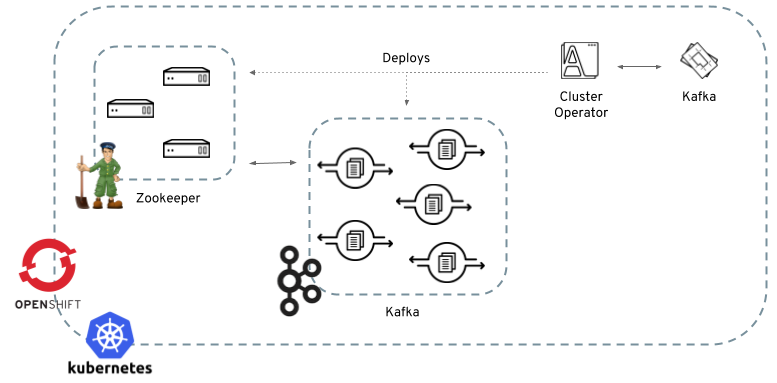

Strimzi uses the Cluster Operator to deploy and manage Kafka (including Zookeeper) and Kafka Connect clusters. The Cluster Operator is deployed inside of the Kubernetes or OpenShift cluster. To deploy a Kafka cluster, a Kafka resource with the cluster configuration has to be created within the Kubernetes or OpenShift cluster. Based on what is declared inside of the Kafka resource, the Cluster Operator deploys a corresponding Kafka cluster.



In this workshop environment, the Kafka operator has been pre-installed ready for use, and is monitoring all projects for requests to create a Kafka cluster. The user you are running the workshop as, has also been delegated the appropriate roles to allow it to act as a Kafka admin.

To validate that your user has been granted the appropriate roles, you can use the `oc auth can-i` command to see whether you can create the custom resource definition (CRD) objects the Kafka operator responds to.

The primary CRD object you need to create to request the creation of a Kafka cluster is the `Kafka` object in the `kafka.strimzi.io` api group. To check that you can create this, run:

```execute
oc auth can-i create kafkas.kafka.strimzi.io
```

Where the response is `yes`, you are good to go and have the appropriate role access.

You can see a list of all the CRD objects used by the Kafka operator by running:

```execute
oc api-resources --api-group kafka.strimzi.io
```

These resources represent Kafka specific elements:

* A __Kafka__ resource for the Kafka cluster. You can use Strimzi to deploy an ephemeral or persistent Kafka cluster to OpenShift or Kubernetes. When installing Kafka, Strimzi also installs a Zookeeper cluster and adds the necessary configuration to connect Kafka with Zookeeper.
* A __KafkaConnect__ resource for the Kafka Connect cluster. [Kafka Connect](https://kafka.apache.org/documentation/#connect) is a tool for streaming data between Apache Kafka and external systems. It provides a framework for moving large amounts of data into and out of your Kafka cluster while maintaining scalability and reliability. Kafka Connect is typically used to integrate Kafka with external databases and storage and messaging systems.
* A __KafkaConnectS2I__ resource for the Kafka Connect cluster with Source2Image support.
* A __KafkaMirrorMaker__ resource for the Kafka Mirror Maker instance. The Cluster Operator can deploy one or more Kafka Mirror Maker replicas to replicate data between Kafka clusters. This process is called mirroring to avoid confusion with the Kafka partitions replication concept. The Mirror Maker consumes messages from the source cluster and republishes those messages to the target cluster.
* A __KafkaTopic__ resource for creating a Topic on a Kafka server. These actions are performed by the Topic Operator.

* A __KafkaUser__ resource to create a user on a Kafka server. These actions are performed by the User Operator.